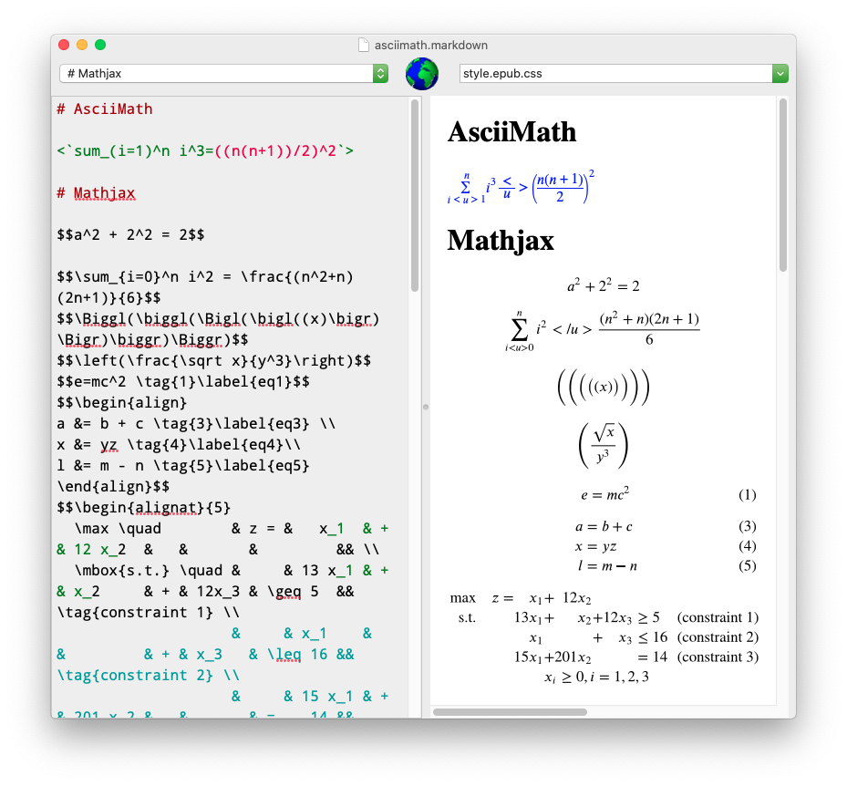
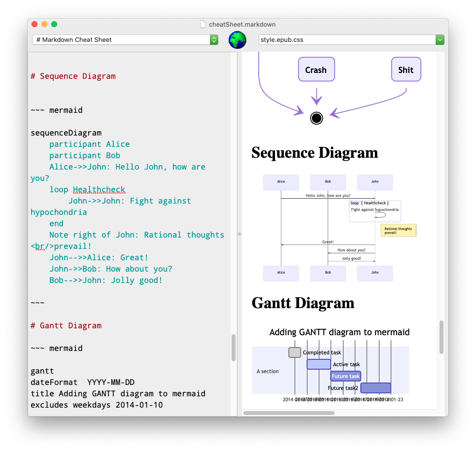
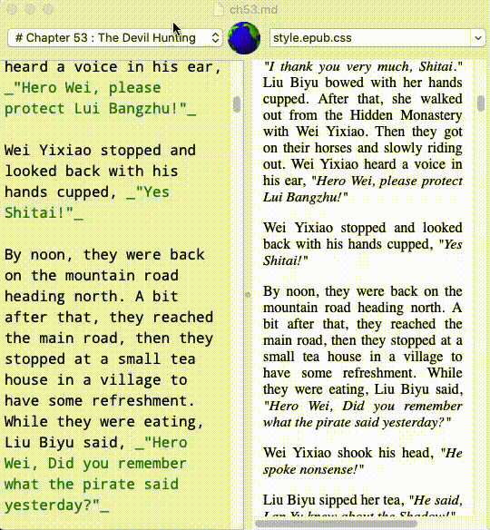

{width=30%}

# MDEtcher 

MDEtcher is yet another markdown editor. It was inspired by MacDown. 

## Why

MacDown had been my markdown editor for a long time. However there are features that I want which are not available in MacDown.

Yes, I have cloned MacDown source to try to add what I want, but MacDown build system uses [POD](https://cocoapods.org/) and [Bundler](http://bundler.io/) which want me to run them as a [sudo](https://en.wikipedia.org/wiki/Sudo). Personally I hate that, so I gave up on the idea. 

## Features

* Text to Speech for proof reading which highlight word as it reads. 
* Support [Pandoc](https://pandoc.org) markdown extension syntax. 
* Support [MathJax](https://www.mathjax.org) and [AsciiMath](http://asciimath.org). 
* Support [Mermaid Diagraming Language](https://mermaid-js.github.io/mermaid/#/). 
* Internet connection is not needed when doing preview with Mathjax, AsciiMath and Mermaid.

## Screenshot

Mathjax and AsciiMath

{width=90%}

Mermaid Diagramming

{width=90%}

Text to Speech Proof Reader

Place cursor at a paragraph, then CMD+t

## Download & Install

[Go to Releases](https://github.com/psksvp/MDEtcher/releases)

Double click on the zip file will unzip it to app bundle MDEtcher.app. 

## Credits

MDEtcher is written using [swift programming language.](https://swift.org)

MDEtcher uses the following great open source components.

* [Pandoc](https://pandoc.org)
* [Mermaid Diagraming](https://mermaid-js.github.io/mermaid/#/)
* [AsciiMath](http://asciimath.org)
* [MathJax](https://www.mathjax.org)
* [Highlightr](https://github.com/raspu/Highlightr) 

## Contact 

<psksvp@gmail.com>

